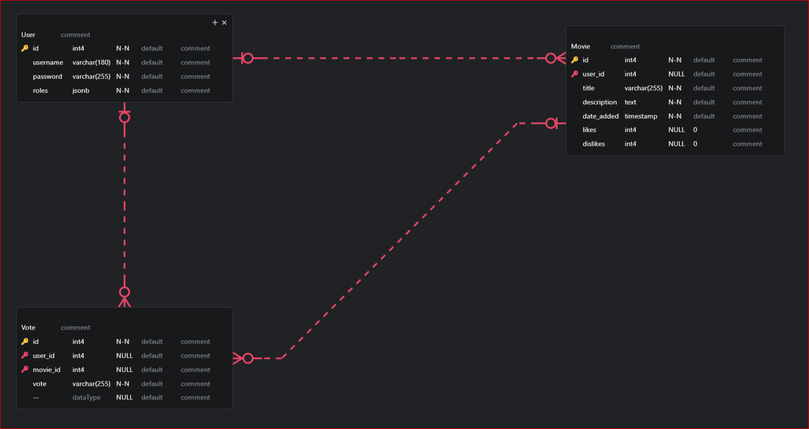

# MovieWorld

MovieWorld is a small project that serves as a social sharing platform where users can share their favorite movies. Users can add movies, express their opinion about movies by liking or hating them, and view a list of movies sorted by various criteria.

## Features

- Users can log in or sign up for a new account.
- Users can add movies to the platform.
- Users can express their opinion about movies by liking or hating them.
- Users can view a list of movies sorted by number of likes, number of hates, or date added.
- Users cannot vote for the movies they have submitted.

## Entity-Relationship Diagram (ERD)



## Schema

### Movie Table
- **id:** (int) Primary key, auto-generated unique identifier for each movie.
- **user_id:** (int) Foreign key referencing the user who submitted the movie.
- **title:** (varchar) Title of the movie.
- **description:** (text) Description of the movie.
- **date_added:** (timestamp) Date when the movie was added to the database.
- **likes:** (int) Number of likes for the movie.
- **dislikes:** (int) Number of dislikes for the movie.

### User Table
- **id:** (int) Primary key, auto-generated unique identifier for each user.
- **username:** (varchar) Unique username for the user.
- **password:** (varchar) Password for the user account.
- **roles:** (jsonb) Roles assigned to the user.

### Vote Table
- **id:** (int) Primary key, auto-generated unique identifier for each vote.
- **user_id:** (int) Foreign key referencing the user who voted.
- **movie_id:** (int) Foreign key referencing the movie that was voted on.
- **vote:** (varchar) Vote cast by the user (like or dislike).

## Associations

### Movie Table:
- **Belongs To:** User
  - Each movie belongs to a user who submitted it.
- **Has Many:** Vote
  - Each movie can have multiple votes from users.

### User Table:
- **Has Many:** Movie
  - Each user can submit multiple movies.
- **Has Many:** Vote
  - Each user can cast multiple votes.

### Vote Table:
- **Belongs To:** User
  - Each vote belongs to a user who cast it.
- **Belongs To:** Movie
  - Each vote is associated with a movie.


## Installation and Usage

## Installation

1. Open a terminal & clone the repository:
    ```bash
    git clone https://github.com/kontisfilippos/MovieWorld.git
    ```

2. Navigate to the project directory:
    ```bash
    cd movieworld
    ```

3. Start Docker using Docker Compose:
    ```bash
    docker-compose up -d
    ```

4. Get inside the Docker shell:
    ```bash
    docker exec -it movieworld-php-1 /bin/bash
    ```

5. Create the database:
    ```bash
    php bin/console doctrine:database:create
    ```

6. Run migrations to set up the database schemas:
    ```bash
    php bin/console doctrine:migrations:migrate
    ```
   Follow the instructions provided and confirm by typing 'yes'.

7. Once the migrations are complete, you are ready to use the Movie World application.
   - Open a browser and go to [localhost/register](http://localhost/register) to create your account.
   - After creating your account, you will be redirected to [localhost/login](http://localhost/login) to log in.
   - Upon successful login, you will be redirected to [localhost/movies](http://localhost/movies) page.
   - Here, you can view movies from all users ordered by date (descending).
   - You can also submit a movie (title & description) by clicking the "Add Movie" button on the [localhost/movies](http://localhost/movies) page.
   - After submitting a movie, you will be redirected back to the [localhost/movies](http://localhost/movies) endpoint, where you can see the movie you submitted along with others, along with their likes, dislikes, and date added.


